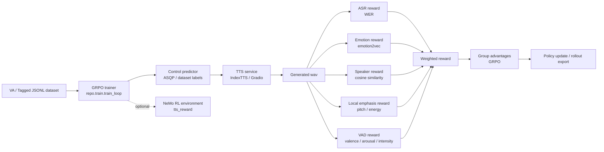
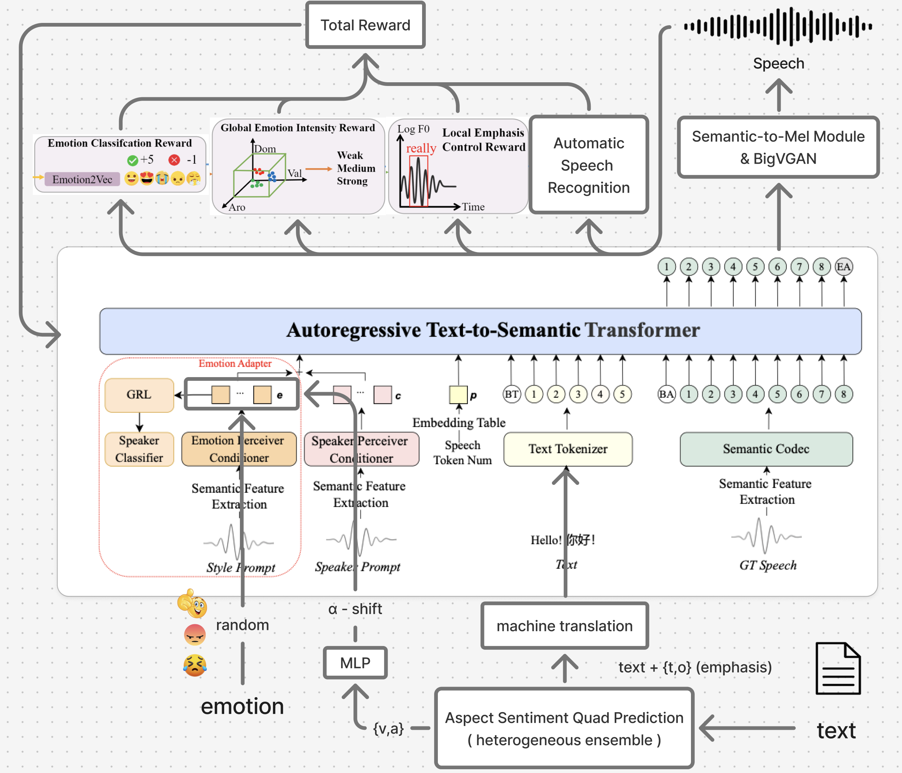

# RL Final Project: Affect-Controlled TTS with GRPO

This repository contains the code for an RL-based Taiwanese/Mandarin speech
generation project. The main goal is to generate speech from restaurant review
text while preserving affective controls such as emotion, valence/arousal,
speaker consistency, local emphasis, and intelligibility.

The repository is intentionally code-first: model checkpoints, datasets,
generated audio, W&B runs, and other large artifacts are ignored and should be
downloaded or mounted separately.

## Architecture

The training pipeline is designed as a set of small HTTP services. Heavy models
run in their own environments, and the trainer only communicates with them
through JSON APIs.



The report-side architecture figure is also tracked here:



## Repository Layout

| Path | Purpose |
| --- | --- |
| `repo/train/` | Training orchestration, component hub, reward aggregation, GRPO rollout generation, service wrappers. |
| `repo/baseline/` | IndexTTS batch generation and baseline inference scripts. |
| `repo/Local_Emphasis/` | Local emphasis reward implementation and examples. |
| `repo/ASR_sys/` | ASR evaluation utilities and manifest preparation. Model files are not stored in Git. |
| `repo/calculate_ss/` | Speaker similarity calculation scripts. |
| `repo/calculate_wer/` | WER calculation and faster-whisper helper scripts. |
| `src/` | Dataset preparation, tagging, overlap checks, and data-building utilities. |
| `repo/Midterm_Report/`, `repo/final_Report/` | Project report sources and figures. |

## Artifact Policy

Do not commit large or generated artifacts. Keep them outside Git, or download
them into ignored paths when needed.

Ignored artifact classes include:

- model/checkpoint files: `*.pt`, `*.pth`, `*.ckpt`, `*.safetensors`, `*.bin`, `*.onnx`, `*.nemo`
- model directories: `models/`, `checkpoints/`, `repo/train/models/`, ASR model folders
- datasets and generated audio: `data/`, `TAT-Vol1/`, `TAT-Vol2/`, `*.wav`
- experiment output: `outputs/`, `repo/outputs/`, `wandb/`, logs, caches
- embedded external repos such as `repo/index-tts/`, `repo/RL/`, `repo/emotion2vec/`

`git lfs ls-files` should normally be empty for this repository. The LFS patterns
in `.gitattributes` are kept as a safety net, but the intended workflow is to
keep models out of the repository entirely.

## Environment

The root project uses Python 3.12 and `uv`.

```bash
uv sync
```

Root dependencies are declared in `pyproject.toml` and include utilities such as
`faster-whisper`, `funasr`, `jiwer`, `clearvoice`, `tqdm`, and `transformers`.

Some heavy components require their own environments. For example, IndexTTS,
ASR, emotion recognition, VAD, and NeMo RL may each need separate dependency
sets. The training code is built around service boundaries so these components
do not need to share one Python environment.

## Quick Start: Mock Pipeline

The mock config exercises the pipeline without loading model checkpoints.

```bash
cd /srv/RL_project

python -m repo.train.pipeline \
  --data repo/train/nemo_rl_data/tts_va_train.jsonl \
  --config repo/train/config.mock.json \
  --limit 3
```

The command writes results under:

```text
repo/train/runs/mock-first-pass/
```

## Quick Start: Mock GRPO Rollouts

```bash
cd /srv/RL_project

python -m repo.train.train_loop \
  --data repo/train/nemo_rl_data/tts_va_train.jsonl \
  --config repo/train/config.mock.json \
  --limit 3
```

For each input example, the trainer samples a candidate group, scores each
candidate, computes normalized group advantages, and writes:

```text
repo/train/runs/mock-first-pass/grpo_rollouts.jsonl
```

## Real Service Layout

For real scoring and generation, start each service in the environment that owns
its model dependencies, then point `repo/train/config.example.json` or a custom
config at those URLs.

Typical service ports:

| Service | Port | Role |
| --- | ---: | --- |
| `asqp` | `8101` | Text to aspect/opinion/VA/emphasis controls. |
| `tts` | `8102` | Text plus controls to generated wav. |
| `asr` | `8103` | Generated wav to transcript / WER reward. |
| `emotion` | `8104` | Generated wav to emotion reward. |
| `speaker` | `8105` | Prompt/generated speaker similarity. |
| `local_emphasis` | `8106` | Local pitch and energy emphasis reward. |
| `vad` | `8107` | Valence/arousal/intensity reward. |

Example local-emphasis service:

```bash
python -m repo.train.services.local_emphasis_service \
  --host 127.0.0.1 \
  --port 8106
```

Example ASR service after downloading or mounting the model outside Git:

```bash
python -m repo.train.services.asr_service \
  --host 127.0.0.1 \
  --port 8103 \
  --model /path/to/whisper-large-v3-turbo-finetuned-pinyin \
  --processor /path/to/whisper-large-v3-turbo-finetuned-pinyin \
  --language zh
```

## Baseline IndexTTS Generation

`repo/baseline/indexTTS_gen.py` runs direct batch inference with IndexTTS and can
consume either a Kaldi text file or a VA/tagged JSONL file.

Example JSONL generation after cloning/downloading IndexTTS and checkpoints
outside Git:

```bash
cd /srv/RL_project/repo/index-tts

uv run python ../baseline/indexTTS_gen.py \
  --input /srv/RL_project/repo/baseline/ensemble_tat_test_task3_least.jsonl \
  --input-format jsonl \
  --text-mode tagged \
  --emotion-mode auto \
  --output-root ../outputs/wav_by_model/indextts_va \
  --manifest ../outputs/manifest_indextts_va.json \
  --index-tts-dir .
```

Generated wavs and manifests are ignored by Git.

## NeMo RL Integration

The project includes a custom NeMo RL environment named `tts_reward` under the
external `repo/RL` checkout. It calls the same `repo/train` component hub, so the
model/API boundaries remain unchanged.

Mock integration command:

```bash
repo/train/run_nemo_rl_tts_grpo.sh
```

Direct NeMo RL command from the external checkout:

```bash
cd /srv/RL_project/repo/RL
uv run examples/run_grpo.py --config examples/configs/tts_grpo_mock.yaml
```

`repo/RL` is intentionally ignored because it is an external repository.

## Model And Data Setup

This repository does not include model checkpoints or large datasets. For real
experiments, place external artifacts in ignored locations or pass absolute
paths in config files and CLI arguments.

Common external artifacts:

- IndexTTS repository and checkpoints for `repo/baseline/indexTTS_gen.py`
- ASR model directory for `repo.train.services.asr_service`
- emotion/VAD/speaker models used by reward services
- TAT datasets and generated wav outputs

Recommended storage options are Hugging Face Hub, GitHub Releases, Google Drive,
or a shared lab/cloud storage bucket. Keep only download instructions or config
templates in Git.

## Useful Checks

Before pushing, make sure the repo still contains no model artifacts:

```bash
git status --short
git lfs ls-files
git rev-list --objects --all | grep -E 'models/|checkpoints/FRCRN_SE_16K|safetensors|\.pth|\.pt|\.ckpt|\.nemo'
```

Expected results:

- `git status --short` is clean before release.
- `git lfs ls-files` is empty.
- the history check should not show model/checkpoint artifacts.

